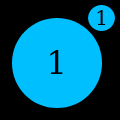
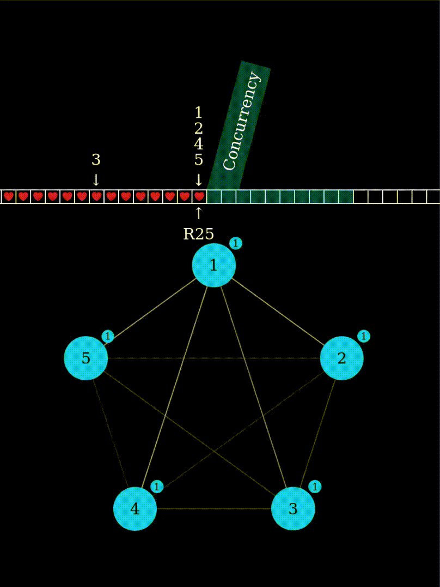
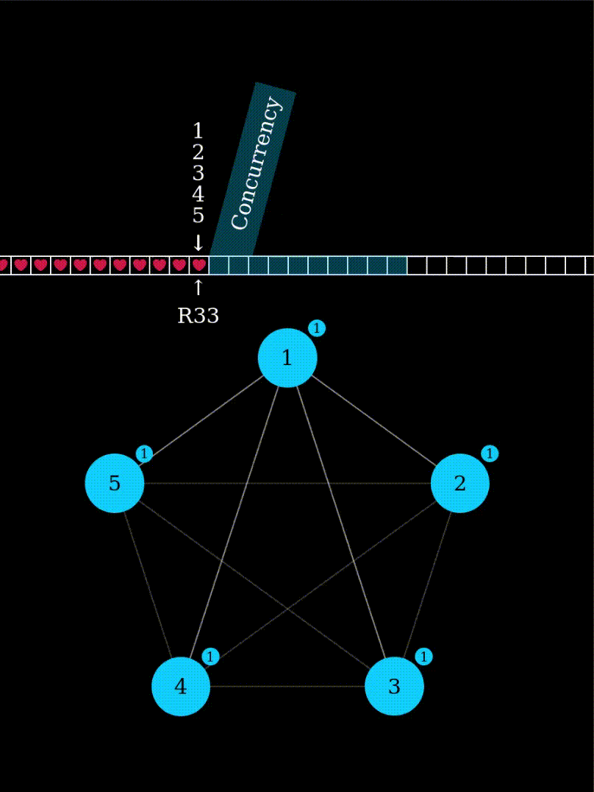
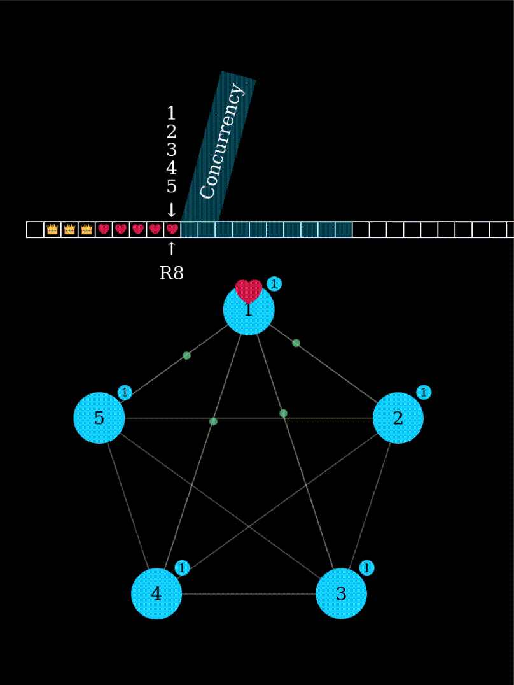

# Playground

This example visualizes an active cluster. It is meant to make the inner
workings of Paxakos apparent. It can also be helpful in debugging—both the
implementation and ones mental model.

NB: Given that the example is illustative and not instructive, please don't use
its code as a template. It is rather messy.

## Visuals

Heres a quick breakdown of some of the visual elements and what they represent.

### Node

A node in either active, passive or terminated state. When a node believes it
knows who's currently in charge, it grows a leader indicator:

### Links

Links between nodes will become more or less pronounced with higher respectively
lower relative use.

### Messages

Messages sent between nodes are visualized as a little ball traveling from the
sender to the receiver. When the message is a response to a prepare or propose
message then the color indicates the reply; green for 'yea' and red for
'nay'/'abstain'.

Dropped messages will fade into nothingness as they travel.

### Actions

Nodes will indicate some common actions.

#### Taking Leadership

Nodes decorated with `EnsureLeadership` will attempt to become leader when the
cluster hasn't advanced in a while. Usually this indicates that the current
leader has been shut down.

#### Heartbeat

Nodes will send heartbeats after a certain amount of quiet time. Unlike the
`EnsureLeadership` decoration, `SendHeartbeats` will never take leadership from
another node.

To minimize unnecessary network traffic, the leader will usually send heartbeats
more frequently than followers.

#### Filling Gaps

When a node discovers a gap in its log it will fill it by attempting to insert
an entry into it. This serves two purposes.

 - It closes 'actual' gaps that are left when an append is aborted and
   concurrent appends for later rounds succeed.
 - When a follower has missed some commits due to, e.g., dropped messages, it
   will catch up.

Like heartbeats, gap filling will never take leadership from another node.

## Interesting Scenarios

### Pollower

When a node is disconnected from the leader, if may follow by polling from other
nodes. It should be noted that the pollower node will fall farther and farther
behind unless the connection to the leader is restored.

### Passive Mode

When a node recovers from a crash, it will temporarily remain passive, i.e. not
vote until it is sure it won't contradict previous votes.

Compare this with a simple restart after a clean shut down, where the node
becomes immediately active.

